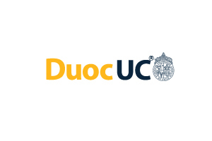

  

# VerdeVida Jardinería - Tienda Web
Este proyecto es una página web de una tienda de jardineria donde los clientes pueden comprar productos de jardineria como tierra de hojas, arbustos, macetero, etc.

## Tabla de Contenidos
- [Descripción](#descripción)
- [Tecnologías Utilizadas](#tecnologías-utilizadas)
- [Créditos](#créditos)

## Descripción
VerdeVida Jardinería es una tienda web dedicada a la venta de productos de jardinería, plantas y accesorios. Este proyecto permite a los usuarios navegar por un catálogo de productos, agregar artículos al carrito, aplicar cupones de descuento y realizar compras de manera sencilla.

## Tecnologías Utilizadas
- HTML5: Para la estructura y contenido de las páginas.
- CSS3: Para el diseño y la presentación visual del sitio.
- JavaScript: Para la lógica de la aplicación, incluyendo la gestión del carrito de compras y la aplicación de cupones.
- Bootstrap: Para el diseño responsivo y componentes de UI.

## Créditos

Este proyecto fue desarrollado por: 
- https://github.com/Aron1244 
- https://github.com/mauricio89777

